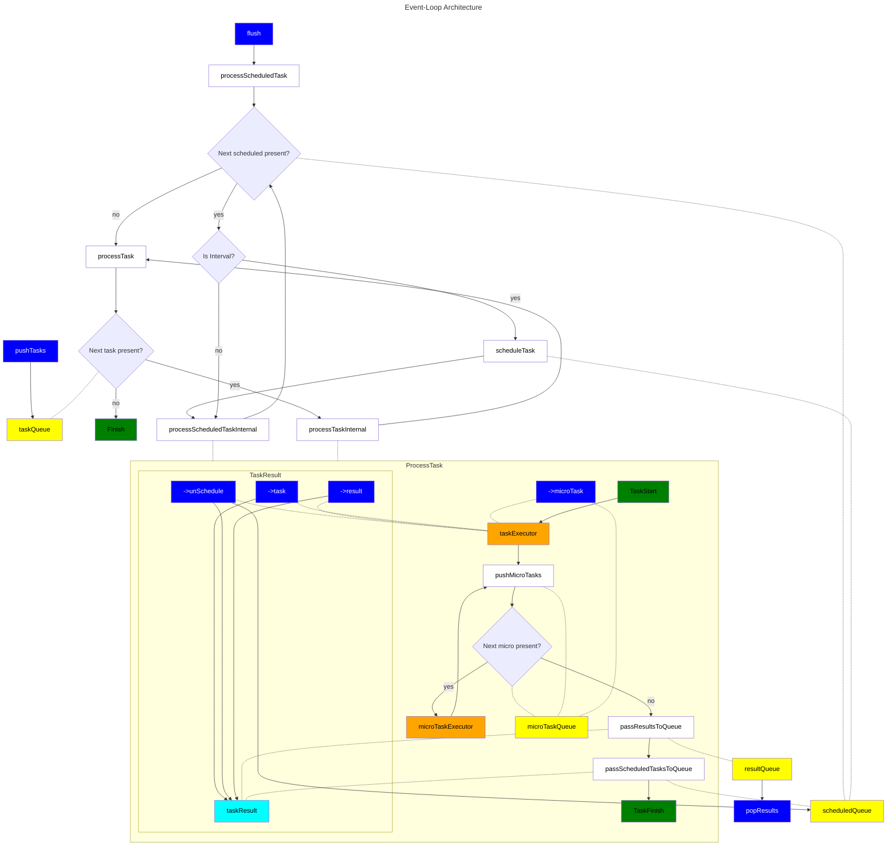

# OdinBasePack

This package contains a group of different data structures I use to develop my odin apps and games.

The most important is event-loop.

This is my custom implementation of event loop lightly inspired by node.js.

This provides a ready to use base for event-driven applications.

Be aware that event-loop implementation is naive and may not meet more sophisticated requirements.

This implementation contains many shortcuts that make implementation simple but makes sacrifices in other areas like performance.

## Architecture

## Information

### Multithreading

This single loop should always run using single thread BUT:
- you can `pushTasks` using different thread
- you can `popResults` using different thread
- you MUST use mutex if you want to `pushTasks` from multiple threads
- you MUST use mutex if you want to `popResults` from multiple threads

Event loop runs inside a single thread but it can execute multithreading work.
For example using [this package](https://github.com/jakubtomsu/jobs) allows to schedule jobs to be executed on separate threads, using syntax similar to javascript `Promise.all`.

### Notes

1. Schedule Tasks
   1. TIMEOUT - single execution delayed by duration (if duration is less or equal 0 task will execute immediately in next flush)
   2. INTERVAL - multiple executions delayed by duration (duration must be greater than 0)
2. UnSchedule Scheduled Tasks
   1. `->task()` procedure returns `ReferenceId` this can be stored and use later for removing task from schedule
   2. unScheduling tasks in the same task execution is much slower
3. Time stops each flush
   1. You provide the time in which flush should happen, this time is the same for all tasks within flush
4. Results are committed to the result queue on flush end
   1. In theory if different thread constantly adds tasks during flush, flush may never end. 
   2. This is something what will probably change in feature, I guess correct solution is to pushResults when task finishes all it's microTasks.

### Usage

Please look at [event loop tests](EventLoop/event-loop.test.odin), my game architecture looks basically the same except I have more detailed error handling and task execution is splitted through many modules rather than having everything in single procedure.

### Contribution
All contributions, bug reports, pull requests, feature requests etc. are more than welcome!