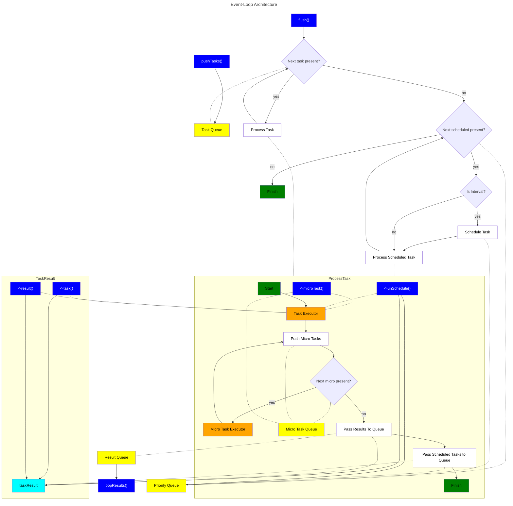

# OdinBasePack

This package contains a group of different data structures I use to develop my odin apps and games.

The most important is event-loop.

This is my custom implementation of event loop lightly inspired by node.js.

This provides a ready to use base for event-driven applications.

Be aware that event-loop implementation is naive and may not meet more sophisticated requirements.

This implementation contains many shortcuts that make implementation trivial but makes sacrifices in other areas like edge-case performance.

## Architecture

## Information

### Multithreading

This single loop should always run using single thread BUT:
- you can `pushTasks()` using different thread
- you can `popResults()` using different thread
- you MUST use mutex if you want to `pushTasks()` from multiple threads
- you MUST use mutex if you want to `popResults()` from multiple threads

Event loop runs inside a single thread but it can execute multithreading work.
For example using [this package](https://github.com/jakubtomsu/jobs) allows to schedule jobs to be executed on separate threads, using syntax similar to javascript `Promise.all`.

### Usage

1. `->task()` - Scheduling New Tasks
   1. TIMEOUT - single execution delayed by duration
      1. if duration is equal to 0 - executes task after all current tasks inside current flush
      2. if duration is greater than 0 - task will not be executed in current flush
   2. INTERVAL - multiple executions delayed by duration
      1. duration must be greater than 0 - tasks will be executed until unScheduled
   3. At the end of task execution scheduled tasks and results are commited to the appriopriate queues.
2. `->unSchedule()` UnSchedule Scheduled Tasks
   1. `->task()` procedure returns `ReferenceId`
   2. `ReferenceId` allows to unSchedule scheduled tasks
3. `->microTask()` Schedule Micro Task
   1. micro task is added to the end of microtask queue, always executes within the same task execution
4. `->result()` Add Result
   1. use this to add results to the result queue, you can then read results using `popResults()` function
5. Event loop current time changes once per flush.
6. In theory if different thread constantly adds tasks during flush, flush may never end. 

### Usage

Please look at [event loop tests](EventLoop/event-loop.test.odin), my game architecture looks basically the same except I have more detailed error handling and task execution is splitted through many modules rather than having everything in single procedure.

### Contribution
All contributions, bug reports, pull requests, feature requests etc. are more than welcome!